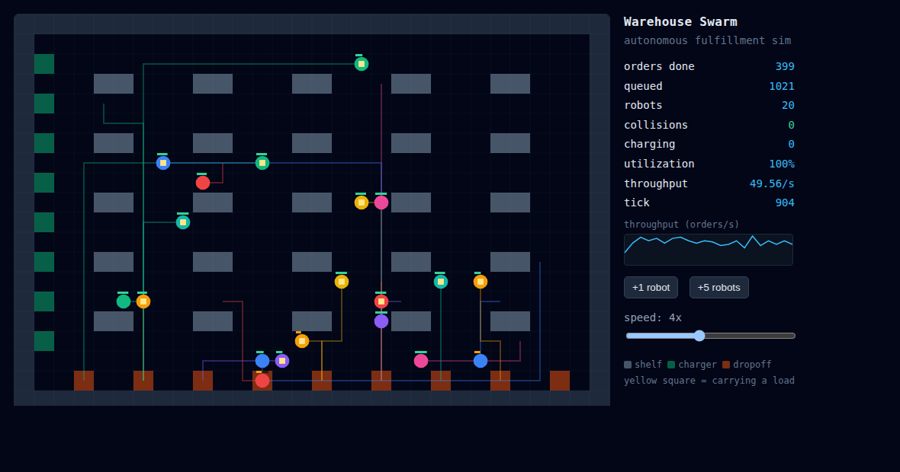

# Warehouse Swarm

An autonomous warehouse robot swarm simulator — robots pick orders from shelves and deliver
them to packing bays, with pathfinding, nearest-robot dispatch, collision-free movement, and
a live dashboard. Built from scratch, zero runtime dependencies (vanilla JS + HTML canvas).



## Run it

```bash
python3 -m http.server 8000      # ES modules need http, not file://
# open http://localhost:8000
```

Watch the robots fulfill orders. Use **+1 / +5 robot** to scale the fleet live and the speed
slider to fast-forward. The dashboard tracks orders done, queue, utilization, throughput, and
collisions (which should stay at 0).

Launch a specific configuration with URL params, e.g.
`http://localhost:8000/?robots=20&rate=1.6&speed=4` (`robots`, `rate`, `speed`, `seed`, `warm`).

**Acceptance scenario in the browser** — inject exactly 500 orders and watch it finish with a
DONE banner: `http://localhost:8000/?orders=500&robots=20&warm=4000`
→ *500 orders delivered in 1228 ticks · 0 collisions*.

## Develop

```bash
npm test                                   # unit tests (node:test, no install)
node tools/scenario.mjs 500 20 7           # acceptance: inject 500 orders, assert all delivered + 0 collisions
node tools/sweep.mjs 40 500 20             # adversarial: same across 40 seeds (try to force a stall/collision)
node tools/run-headless.mjs 20 8000 1.4 7  # free-run headless -> JSON stats (robots ticks rate seed)
bash tools/shot.sh .shot/sim.png           # screenshot the live sim (needs google-chrome)
```

## Layout

```
index.html            canvas + HUD + controls
src/
  grid.js             cell types, warehouse layout, BFS pathfinding
  rng.js              seeded RNG (deterministic runs)
  orders.js           order model + generator
  dispatch.js         nearest-idle-robot assignment
  robot.js            robot state
  sim.js              the world: one step() = generate -> assign -> move -> arrivals
  render.js           draw the world to a canvas
  main.js             browser loop + controls
test/                 unit tests (grid, dispatch, sim)
tools/                headless runner + screenshot helper
```

Status and roadmap: see [`progress.md`](progress.md).
